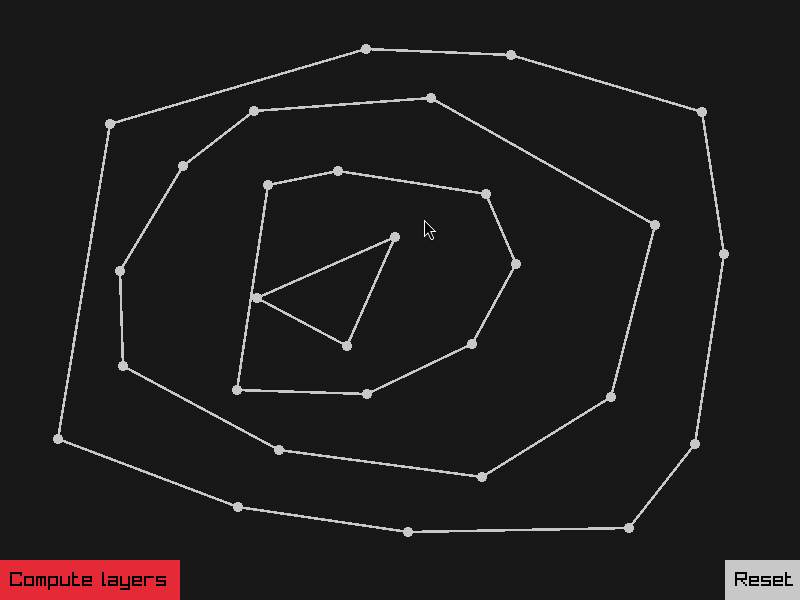

# Convex layers

[](https://github.com/marketplace/actions/super-linter)
[](https://github.com/semantic-release/semantic-release)

Compute convex hull.

Reference: [Quickhull](https://en.wikipedia.org/wiki/Quickhull).



## Getting Started

Run:
```console
./build.sh
```

### Prerequisites

Make sure prerequisites from raylib are met ().

## Usage

Run the application:

```console
./convex_hull
```

### Controls

Mouse left button: add points.

Mouse right button: move points.

`Reset` button: reset the added points.

`Compute layers` button: draw convex hull of points.
